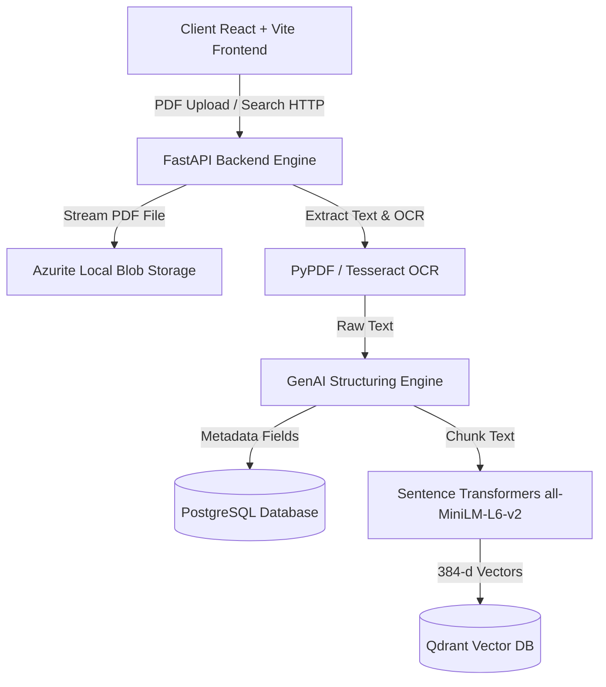

# System Architecture: Intelligent Invoice Processing System

## Component Architecture Overview
1. **Frontend (React 18 + Vite + Vanilla CSS)**: Provides a dark-mode glassmorphic user dashboard featuring live document upload, processing feedback, semantic query search, and side-by-side PDF preview.
2. **Backend Engine (FastAPI)**: REST endpoints managing asynchronous background tasks for upload, OCR processing, vector index generation, and hybrid PostgreSQL + Qdrant search execution.
3. **Blob Storage (Azurite)**: Emulates Azure Blob Storage locally (`invoices-raw` container) to archive original uploaded PDF files.
4. **Relational Database (PostgreSQL)**: Stores structured invoice metadata (vendor, invoice #, amounts, line items, dates, status).
5. **Vector Database (Qdrant)**: Stores 384-dimensional dense semantic embeddings of invoice contents for natural language similarity querying.
